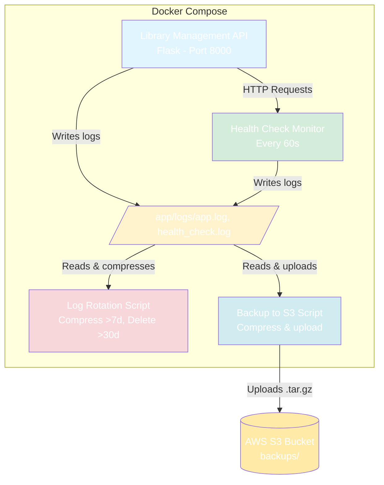

# DevOps Automation Toolkit


Complete DevOps automation toolkit demonstrating essential operations tools with a real-world application.

## 🎯 Purpose

This project demonstrates practical implementation of key DevOps tools:
- **Automated monitoring** of services
- **Automatic backups** to cloud storage
- **Log management** with intelligent rotation
- **Containerization** with Docker
- **CI/CD** with GitHub Actions

### Interactive View (Mermaid)


## Components

### 1. Library Management API (`app/`)
A lightweight Flask application simulating a library management system.

**Endpoints:**
- `GET /` - Service information
- `GET /health` - Health check (occasionally simulates failures)
- `GET /api/books` - List of books
- `GET /api/books/<id>` - Specific book
- `POST /api/books` - Add book
- `GET /metrics` - Application metrics

**Features:**
- Structured logging
- Occasional failure simulation (for monitoring testing)
- Basic metrics

### 2. Health Check Monitor (`scripts/health_check.py`)
Monitors availability of web services.

**Functionalities:**
- Verifies multiple endpoints
- Records response times
- Detects failures and timeouts
- Continuous mode with configurable interval
- Detailed logging of all checks

**Usage:**
```bash
# Single check
python scripts/health_check.py

# Continuous monitoring (every 60s)
python scripts/health_check.py --continuous 60
```

### 3. Backup to S3 (`scripts/backup_to_s3.py`)
Automates directory backups to AWS S3.

**Functionalities:**
- Automatic compression (tar.gz)
- S3 upload with timestamp naming
- Specific mode for application logs
- Generic mode for any directory

**Usage:**
```bash
# Backup application logs
python scripts/backup_to_s3.py my-s3-bucket

# Backup specific directory
python scripts/backup_to_s3.py /path/to/directory my-s3-bucket
```

**Requirements:**
- AWS CLI configured ('aws configure')
- IAM credentials with S3 permissions

### 4. Log Rotation (`scripts/log_rotation.py`)
Intelligent log file management.

**Functionalities:**
- Compresses logs older than 7 days
- Deletes compressed logs older than 30 days
- Reports disk space saved

**Usage:**
```bash
python scripts/log_rotation.py
```

## Quick Start

### Prerequisites
- Docker & Docker Compose
- Python 3.11+
- AWS CLI (for S3 backups)

### 1. Clone repository
```bash
git clone https://github.com/CandoJhon/devops-automation-toolkit.git
cd devops-automation-toolkit
```

### 2. Start infrastructure
```bash
docker-compose up -d
```

This starts:
- > Library API at `http://localhost:8000`
- > Health monitor (running every 60s)

### 3. Verify functionality
```bash
# Test API
curl http://localhost:8000/health

# View health monitor logs
docker logs -f health-monitor

# View application logs
tail -f app/logs/app.log
```

### 4. Run scripts manually

**Single health check:**
```bash
cd scripts
pip install -r requirements.txt
python health_check.py
```

**Backup logs:**
```bash
# First configure AWS CLI
# Then run backup
python backup_to_s3.py my-s3-bucket
```

**Log rotation:**
```bash
python log_rotation.py
```

You'll see how the health monitor detects and logs failures.

## 🧪 Testing
### Execute local tests
```bash
# install dependencies for testing
pip install -r requirements-dev.txt

# run all tests
pytest tests/ -v

# run with coverage
pytest tests/ -v --cov=scripts --cov-report=html

# report coverage
open htmlcov/index.html
```

### Integration test

test integration need run the api:
```bash
# Terminal 1: build infrastructure
docker compose up

# Terminal 2: run test integration
pytest tests/test_integration.py -v
```

## Troubleshooting

### Permission denied when running docker compose

**Linux:**
```bash
sudo usermod -aG docker $USER
newgrp docker
docker-compose up -d
```


## Future Improvements

- [ ] Prometheus integration for metrics
- [ ] Email/Slack notifications
- [ ] Azure Blob Storage support


### Why Flask for the demo app?
- Lightweight and quick to implement
- Sufficient to demonstrate DevOps concepts
- Widely used in production

### Why Python for scripts?
- Excellent library ecosystem (boto3, requests)
- Clean and maintainable syntax
- Cross-platform

### Why Docker Compose vs Kubernetes?
- Simpler for local demo
- No cluster required
- Easier reproducibility


## 👤 Author

**Jhon Cando**
- LinkedIn: [linkedin.com/in/jhon-cando](https://www.linkedin.com/in/jhon-cando/)
- GitHub: [@CandoJhon](https://github.com/CandoJhon)

---
